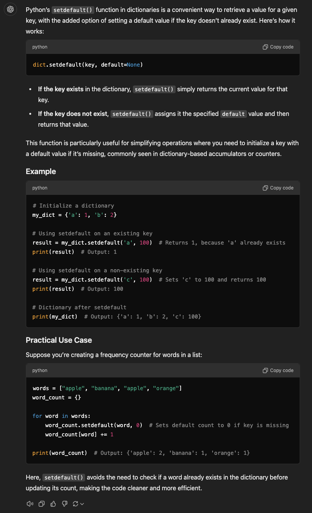

# Exercise 1 - Ask a Virtual Assistant

## Question 1
* Ask a virtual assistant how `setdefault` works.
 


## Question 2 
* Re-write add_bigram with `setdefault`

Prior to re-write
```python
successor_map = {}

def add_bigram(bigram):
    first, second = bigram
    
    if first not in successor_map:
        successor_map[first] = [second]
    else:
        successor_map[first].append(second)
```

After re-write
```python
successor_map = {}

def add_bigram(bigram):
    first, second = bigram
    successor_map.setdefault(first, []).append(second)
```


## Question 3
* What are the differences between large language models like GPT and Markov chain text analysis?

---

GPT Response below

---

Large language models (LLMs) like GPT and Markov chain text analysis are both approaches to generating and analyzing text, but they differ significantly in complexity, methodology, and capability. Here’s a breakdown of their differences:

### 1. **Underlying Mechanics**

- **Markov Chains**: A Markov chain generates text by predicting the next word based only on the current word (or sometimes a small sequence of previous words) in the text. It uses a probability table built from training data to decide which word is likely to follow each word or sequence. This approach relies heavily on conditional probabilities and lacks any understanding of sentence structure or meaning.
  
- **GPT (Generative Pretrained Transformer)**: GPT models, part of the family of transformer-based large language models, are neural networks with millions or billions of parameters. They predict the next word by considering the entire context of a given input sequence, rather than just the last word or two. GPT models can handle long dependencies and relationships between words and sentences through self-attention mechanisms, enabling them to "understand" context, nuances, and even complex relationships between topics across longer text.

### 2. **Memory and Context**

- **Markov Chains**: Markov models typically use a fixed "n-gram" context (e.g., a unigram, bigram, or trigram) to predict the next item, so they are limited to very short-term memory. They do not carry over information from previous sentences or paragraphs, making them more suited to generating text that doesn’t rely on long-term context.

- **GPT**: Large language models like GPT process a much larger span of text (up to thousands of words), making it possible to maintain a memory of context over paragraphs or even pages of text. This capability is crucial for generating coherent long-form text or responding accurately in conversations.

### 3. **Training Complexity**

- **Markov Chains**: Building a Markov chain model involves counting occurrences of word pairs or n-grams and computing their probabilities, making it relatively simple to train and implement. However, its simplicity limits the quality and coherence of text it generates, especially in complex or structured domains.

- **GPT**: GPT models undergo extensive training on massive text datasets with billions of words. The training process involves adjusting millions or billions of parameters through backpropagation and requires large-scale computing resources. The training captures complex language patterns, syntax, grammar, context, and even general world knowledge.

### 4. **Output Quality**

- **Markov Chains**: Markov models can produce repetitive and somewhat coherent output at a small scale, but they often lack logical flow, consistency, and coherence over longer stretches of text. The generated text might be choppy and nonsensical if there’s no clear local connection between successive n-grams.

- **GPT**: GPT’s outputs are generally more coherent, natural, and contextually appropriate. GPT models can maintain narrative flow and thematic consistency over longer passages, generate structured responses, and answer questions with some degree of accuracy and relevance.

### 5. **Handling Ambiguity and Creativity**

- **Markov Chains**: Due to their lack of memory and context, Markov chains have limited capability to handle ambiguous inputs or produce creative responses. They generate text that closely resembles the patterns they were trained on but fail at extrapolating new or unique information.

- **GPT**: GPT models, with their deep understanding of context and access to vast training data, are capable of handling ambiguous prompts, producing creative content, and generalizing across various topics. They can even mimic different writing styles or simulate understanding of complex topics.

### Summary Table

| Feature                  | Markov Chains                                 | GPT Models                                         |
|--------------------------|-----------------------------------------------|----------------------------------------------------|
| **Memory**               | Short-term (n-grams)                          | Long-term (can handle entire paragraphs)           |
| **Context**              | Local (previous word or n-gram only)          | Global (entire input sequence)                     |
| **Training Complexity**  | Simple, fast                                  | Complex, resource-intensive                        |
| **Output Coherence**     | Limited, often repetitive or nonsensical      | High, coherent, and contextually relevant          |
| **Handling Ambiguity**   | Poor                                          | Strong                                             |
| **Creativity and Generalization** | Very limited                         | High                                               |

In essence, Markov chains are simpler and faster but are limited in their capacity for contextual understanding. In contrast, large language models like GPT use complex architectures and large-scale training to provide coherent, contextually aware, and highly versatile text generation.
